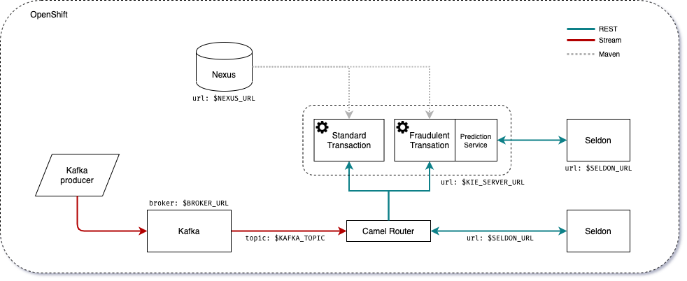

# CCFD demo



# Contents

- [CCFD demo](#ccfd-demo)
- [Contents](#contents)
  - [Setup](#setup)
    - [Requirements](#requirements)
    - [Running on OpenShift](#running-on-openshift)
      - [Kafka](#kafka)
      - [Kafka producer](#kafka-producer)
      - [Seldon](#seldon)
      - [Kie server](#kie-server)
        - [Nexus](#nexus)
        - [Execution server](#execution-server)
          - [Execution server optional configuration](#execution-server-optional-configuration)
          - [Building from source](#building-from-source)
      - [Notification service](#notification-service)
        - [Building from source](#building-from-source-1)
      - [Camel router](#camel-router)
        - [Building from source](#building-from-source-2)
      - [Optional](#optional)
        - [Building the KJARs](#building-the-kjars)
    - [Running locally](#running-locally)
    - [Environment variables](#environment-variables)
  - [Description](#description)
    - [Business processes](#business-processes)
  - [Footnotes](#footnotes)

## Setup

### Requirements

For an OpenShift deployment:

* OpenShift 4.x cluster
* `oc`

For testing locally:

* `docker-compose`

### Running on OpenShift

To deploy all the components in OpenShift, the simplest way is to login using `oc`, *e.g.*:

```shell
$ oc login -u <USER>
```

Next you can create a project for this demo, such as:

```shell
$ oc new-project ccfd
```

#### Kafka

[Strimzi](https://strimzi.io/) is used to provide Apache Kafka on OpenShift. Start by applying the operator [^0] and the cluster deployment with:

```shell
$ oc apply -f https://github.com/strimzi/strimzi-kafka-operator/releases/download/0.16.2/strimzi-cluster-operator-0.16.2.yaml
$ oc apply -f deployment/ccfd-kafka.yaml
$ oc wait kafka/ccfd --for=condition=Ready --timeout=300s
```

Optionally, expose the Kafka service with

```shell
$ oc expose svc/ccfd-kafka-brokers
```

#### Kafka producer

To start the Kafka producer (which simulates the transaction events) run:

```shell
$ oc new-app python:3.6~https://github.com/ruivieira/ccfd-kafka-producer \
    -e BROKER_URL=ccfd-kafka-brokers:9092 \
    -e KAFKA_TOPIC=ccd
```

The Kafka producer creates a message stream with data from a sample of the [Kaggle credit card fraud dataset](https://www.kaggle.com/mlg-ulb/creditcardfraud).

#### Seldon

To deploy the Seldon model server, deploy the already built Docker image with

```shell
$ oc new-app ruivieira/ccfd-seldon-model
$ oc expose svc/ccfd-seldon-model
```

#### Kie server

The business processes to be executed by the KIE server are located in KJARs.
The first step is to setup a Nexus repository on OpenShift in order to deploy the KJARs. The KIE server will then be able to resolve the needed dependencies at runtime.

##### Nexus

To deploy a Nexus repository on OpenShift, simply run:

```shell
$ oc new-app sonatype/nexus
$ oc expose svc/nexus
```

##### Execution server

To deploy the KIE server, the container image `ruivieira/ccd-service` can be used (located [here](https://hub.docker.com/repository/docker/ruivieira/ccd-service)),  deploying it with:

```shell
$ oc new-app ruivieira/ccd-service:1.0-SNAPSHOT \
    -e SELDON_URL=ccfd-seldon-model:5000 \
    -e NEXUS_URL=http://nexus:8081 \
    -e CUSTOMER_NOTIFICATION_TOPIC=ccd-customer-outgoing \
    -e BROKER_URL=ccfd-kafka-brokers:9092
```

###### Execution server optional configuration

If the Seldon server requires an authentication token, this can be passed to the KIE server by adding the following environment variable:

```shell
-e SELDON_TOKEN=<SELDON_TOKEN>
```

By default, the KIE server will request a prediction to the endpoint `<SELDON_URL>/predict`. If however, your Seldon deployment uses another prediction endpoint, you can specify it by adding the `SELDON_ENDPOINT` enviroment variable above, for instance:

```shell
-e SELDON_ENDPOINT=api/v0.1/predictions
```

The HTTP connection parameters can also be configured, namely the _connection pool size_ and the connections _timeout_. The timeout value provided is treated as milliseconds. For instance:

```shell
-e SELDON_TIMEOUT=5000 \ # five second timeout
-e SELDON_POOL_SIZE=5    # allows for 5 simulataneous HTTP connections
```

The prediction service's _confidence threshold_, above which a prediction automatically assigns an output and
closes the user task can be also provided. It is assumed to be a probability value between `0.0` and `1.0`.
If not provided, the default value is `1.0`. To specify it use:

```shell
-e CONFIDENCE_THRESHOLD=0.5 # as an example
```

If you want to interact with the KIE server's REST interface from outside OpenShift, you can expose its service with

```shell
$ oc expose svc/ccd-service
```

###### Building from source

If you want to build the execution server from the source, you will need Maven and a JDK need to be available on your local machine. 
First clone this repository:

```shell
$ git clone https://github.com/ruivieira/ccfd-demo.git
```

Next, we use `fabric8` to build the images as[^1]:

```shell
$ cd ccfd-demo
$ mvn -f ccd-model/pom.xml clean install
$ mvn -f ccd-standard-kjar/pom.xml clean install -P openshift
$ mvn -f ccd-fraud-kjar/pom.xml clean install -P openshift
$ mvn -f ccd-service/pom.xml clean install -P openshift,h2
```

Or simply run `build.sh`. Once the images are built, we deploy them on OpenShift using the same commands as in the previous section.

#### Notification service

The notification service is an event-driven micro-service responsible for relaying notifications to the customer and customer responses. 

If a message is sent to a "customer outgoing" Kafka topic, a notification is sent to the customer asking whether the transaction was legitimate or not. For this demo, the micro-service simulates customer interaction, but different communication methods can be built on top of it (email, SMS, *etc*).

If the customer replies (in both scenarios: they either made the transaction or not), a message is written to a "customer response" topic. The router (described below) subscribes to messages in this topic, and signals the business process with the customer response.

To deploy the notification service, we use the image `ruivieira/ccfd-notification-service` (available [here](https://hub.docker.com/repository/docker/ruivieira/ccfd-notification-service)), by running:

```shell
$ oc new-app ruivieira/ccfd-notification-service:1.0-SNAPSHOT \
    -e BROKER_URL=ccfd-kafka-brokers:9092
```

##### Building from source

To build the notification service from the source, start by cloning the service's [repository](https://github.com/ruivieira/ccfd-notification-service):

```shell
$ git clone https://github.com/ruivieira/ccfd-notification-service.git
```

You can then use `oc` to setup the `BuildConfig` and `ImageStream`:

```shell
$ oc new-build --binary --name=ccfd-notification-service -l app=quarkus-ccfd-notification-service
$ oc patch bc/ccfd-notification-service -p "{\"spec\":{\"strategy\":{\"dockerStrategy\":{\"dockerfilePath\":\"src/main/docker/Dockerfile.native\"}}}}"
$ oc start-build ccfd-notification-service --from-dir=. --follow

```

Once it's built, you can deploy it using

```shell
$ oc new-app --image-stream=ccfd-notification-service:latest \
    -e BROKER_URL=ccfd-kafka-brokers:9092
```

#### Camel router

The Camel router is responsible consume messages arriving in specific topics, requesting a prediction to the Seldon model, and then triggering different REST endpoints according to that prediction.
The route is selected depending on whether a transaction is predicted as fraudulent or not. Depending on the model's prediction a specific business process will be triggered on the KIE server.
To deploy a router with listens to the topic `KAFKA_TOPIC` from Kafka's broker `BROKER_URL` and starts a process instance on the KIE server at `KIE_SERVER_URL`, we can use the built image `ruimvieira/ccd-fuse` (available [here](https://hub.docker.com/repository/docker/ruivieira/ccd-fuse)):

```shell
$ oc new-app ruivieira/ccd-fuse:1.0-SNAPSHOT \
    -e BROKER_URL=ccfd-kafka-brokers:9092 \
    -e KAFKA_TOPIC=ccd \
    -e KIE_SERVER_URL=http://ccd-service:8090 \
    -e SELDON_URL=http://ccfd-seldon-model:5000 \
    -e CUSTOMER_NOTIFICATION_TOPIC=ccd-customer-outgoing \
    -e CUSTOMER_RESPONSE_TOPIC=ccd-customer-response
```

Also optionally, a Seldon token can be provided:

```shell
-e SELDON_TOKEN=<SELDON_TOKEN>
```

By default, the router will request a prediction to the endpoint `<SELDON_URL>/predict`. If however, your Seldon deployment uses another prediction endpoint, you can specify it by adding the `SELDON_ENDPOINT` enviroment variable above, for instance:

```shell
-e SELDON_ENDPOINT=api/v0.1/predictions
```

##### Building from source

To build the router from source, first clone the [repository](https://github.com/ruivieira/ccfd-fuse) and build it with:

```shell
$ git clone https://github.com/ruivieira/ccfd-fuse.git
$ mvn -f ccfd-fuse/pom.xml clean install -P openshift
```

and then deploy it with the same commands as the previous section.


#### Optional


##### Building the KJARs

The KJARs are available at the  [ccfd-kjars](https://github.com/ruivieira/ccfd-kjars) git repository. To build them:

```shell
$ git clone https://github.com/ruivieira/ccfd-kjars.git
$ cd ccfd-kjars
$ NEXUS_URL=<NEXUS_URL> mvn clean deploy
```


### Running locally

To run a local version of this demo locally a Docker compose is provided. The demo can be started using the `docker-composer up` command.

If you prefer to start the services individually,  the preferred order of instantiation is:

* `zoo1` and `kafka1` - Zookeeper and Apache Kafka
* `seldon ` - Seldon model server
* `kieserver ` - KIE execution server
* `kafka-producer` - Kafka transaction producer
* `notification` - Customer notification service
* `camel` - Apache Camel router

### Environment variables

* `BROKER_URL` - Kafka's broker adress
* `SELDON_URL`  - Seldon's server address
* `KAFKA_TOPIC` - topic which Camel listen too
* `SELDON_TOKEN` (optional) - Seldon's authentication token

## Description

### Business processes


The Business Process (BP) corresponding to a potential fraudulent transaction consists of the following flow:

* The process is instantiated with the transaction's data
* The `CustomerNotification` node sends a message to the `<CUSTOMER-OUTGOING>` topic with the customer's `id` and the transaction's `id`
* At this point, either one of the two branches will be active:
  * If no customer response is receive, after a certain specified time, a timer will trigger the creation of a User Task, assigned to a fraud investigator.
  * If (before the timer expires) a response sent, the process is notified via a signal, containing the customer's response as the payload (either `true`, the customer made the transation or `false`, they did not). From here two additional branches:
    * If the customer acknowledges the transaction, it is automatically approved
    * If not, the transaction is cancelled

The customer notification/response works by:

* Sending a message with the customer and transaction id to `<CUSTOMER-OUTGOING>` topic
* This message is picked by the [notification service](#notification-service), which will send an approriate notification (email, SMS, *etc*) 
* Customer response is sent to the `<CUSTOMER-RESPONSE>` topic, which is picked by the Camel router, which in turn sends it to the appropriate container, using a KIE server REST endpoint, as a signal containing the customer response

## Footnotes

[^0]: In case you need cluster admin privileges to deploy Strimzi, in which case (in a development setup)  you can run `oc adm policy add-cluster-role-to-user cluster-admin system:serviceaccount:default:strimzi-cluster-operator`.
[^1]: You might need to add the appropriate server to Maven's `settings.xml` as per 